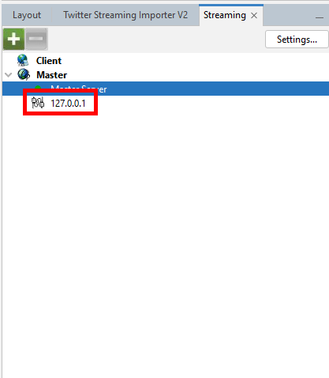

# Bksy to Gephi

Bksy to Gephi is a small application that allows you to navigate and visualise the network of followers in Bluesky / ATProtocol.

Keep in mind that it's a "toy" project, I'm not expert in JS 

# What you need  

* Download and Install Gephi (https://gephi.org/)
* In Gephi, on Tools > Plugin , install the `Graph Streaming` plugin
* A Bluesky account
* Generate an application password on Bluesky (https://bsky.app/settings/app-passwords)

# Quick Start

## Prepare Gephi.

- Open Gephi, if you installed the  `Graph Streaming` plugin, you should have a tab on the left-bottom side called `Streaming`. Select this table and click on `Settings...`.
- On **HTTP Server Settings** > **Port** set `9876` (or any port available). Then click on `Ok`.
- Right-Click on `Master Server` and select `Start`. The dot next to it should become green.

## Bskytogephi
- Go to https://totetmatt.github.io/bskytogephi .
- Enter your bsky handle and bksy app password. Click on `Connect`, if all good, it should become Green.
- For the url enter `ws://localhost:9876` (adapt port if needed) and then click on `Connect`. If all good, it should become Green, you should also see an entry on the Streaming plugin on Gephi.
- Get ego network : Put any bsky handle or did. Click on Ok, the network should appears on Gephi.
- A list of user will appears. If you click on them, it will fetch their network and update to Gephi.

Quickstart Video : https://www.youtube.com/watch?v=S9WPYKwFCa8

# Collaborative search
(Will detail later)
If you are multiple persons, you can centralise you search by having One gephi server running and all "client" sending to the correct address. 